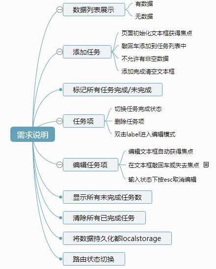

## TodoMVC App Template

> Practise how to use Vue

## requirement



## Knowledge point

1.  global / local component

   - component hook  function(bind / unbind / insert / update)
   - when want to operate DOM

2. Modifier

   - v-model.trim
   - @keyup.enter

3. :class

   `{completed: todo.completed,editing: todo === currentEditing}`

   `{selected: visibility === 'all'}`

4. window.localStorage

   - 字符串
   - JSON.stringify
   - JSON.parse

5. el / data / methods / directives / computed / watch(deep, immediate..) / filters / created ( other hook function)

6. Lifecycle

   - beforeCreate
   - created   （send ajax request, handle data）
   - beforeMount (template has not be compiled like :{{xxxx}})
   - mounted  (handle compiled template）
   - beforeUpdate
   - updated
   - activated (dynamic component)
   - deactivated  (dynamic component)
   - beforeDestroy
   - destroyed
   - errorCaptured

7. computed vs methods

   - methods 也可以用于模板绑定

     ```
     getLeftTodoCount() {
     	return filter.active(this.todos)
     }
     
     // html
     {{ getLeftTodoCount() }}
     ```

   - 看着是方法但当属性使用

   - computed和methods能达到同样的效果

   - computed有缓存,其触发依赖于计算的数据,更高效

   - method没有缓存,多次调用则重复执行多次,哪怕返回固定值,只要绑定函数的视图模板若更新,函数就会被调用

8. computed vs watch

   - computed一般用于返回数据
   - watch用于业务逻辑 不需要模板绑定, 只是纯粹监视成员改变而加入业务功能
   - asynchronous or expensive operations in response to changing data

9. computed setter / getter（默认只有getter）

10. window.onhashchange

    - window.addEventListener('hashchange', onhashchange)

11. v-for  :key

12. v-if vs v-show

    - v-show --> display:none
    - 一般来说，`v-if` 有更高的切换开销，而 `v-show` 有更高的初始渲染开销。因此，如果需要非常频繁地切换，`v-show`较好；如果在运行时条件很少改变，`v-if` 较好。

13. v-cloak

14. v-model / @ / :

